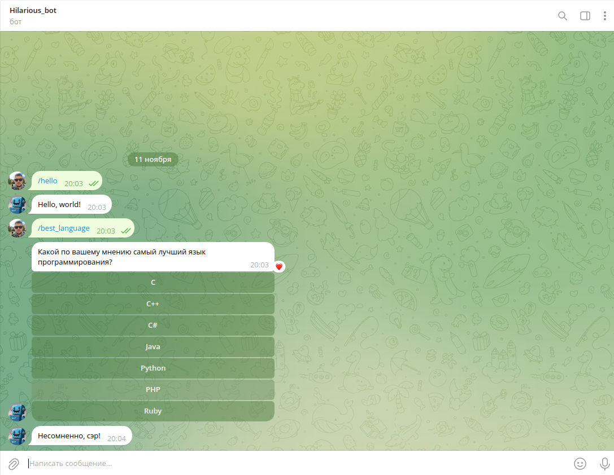

# Telegram Bot 🤖

This project is a foundation for building a multifunctional Telegram bot, utilizing 
the [defstudio/telegraph](https://github.com/defstudio/telegraph?tab=readme-ov-file) library. It is developed 
for educational purposes and can be customized according to your needs by extending the capabilities of the library.

## Features:
- Easily extendable for various chatbot functionalities
- Integrated with ngrok for exposing local servers to the internet
- Containerized for easy deployment using Docker

## Technology Stack:
- **Backend**: Laravel (PHP 8.2)
- **Database**: MySQL 8.0
- **Web Server**: Nginx
- **Containerization**: Docker, Docker Compose
- **Tunneling**: Ngrok

## Project Setup

### 1.  Clone the repository

First, clone the project to your local machine:

```bash
git clone https://github.com/Andrey-Yurchuk/telegram_bot.git
```
Then navigate into the project directory:

```bash
cd telegram_bot
```

### 2. Install dependencies

```bash
composer install
```

### 3. Set up .env file

Copy the .env.example file to create your .env configuration file:

```bash
cp .env.example .env
```

### 4. Update .env

Edit the .env file to include your specific configuration. Here are the key variables:
- `APP_KEY` (generate the application key with the following command `docker-compose exec laravel.app php artisan key:generate`):

```bash
APP_NAME=telegram_bot
APP_ENV=local
APP_KEY=<your_laravel_key>
APP_DEBUG=true
APP_TIMEZONE=UTC
``` 
- To get `NGROK_AUTH`:
1. Go to [ngrok](https://ngrok.com) and sign up or log in;
2. Visit your dashboard;
3. Copy the token from the "Your Authtoken" section;
4. Add it to your .env file:

```bash
NGROK_AUTH=<your_ngrok_auth_token>
```
Database credentials: configure your MySQL database credentials:

```bash
DB_CONNECTION=mysql
DB_HOST=mysql
DB_PORT=3308
DB_DATABASE=telegram_bot
DB_USERNAME=<your_user>
DB_PASSWORD=<your_password>
``` 

### 5. Build and start Docker containers

Use Docker Compose to build and run the containers:

```bash
docker-compose build
docker-compose up -d
``` 
After starting the containers, visit http://127.0.0.1:4040 to get the temporary ngrok domain. Then, update 
the `APP_URL` in your .env file with this domain:

```bash
APP_URL=https://<your_ngrok_domain>
```
⚠️ The `APP_URL` address changes when the docker-containers are restarted. After restarting the containers 
it is necessary to write the new received address in `APP_URL`

The following containers will be started:

- Laravel App
- MySQL
- Nginx
- Ngrok

### 6. Run database migrations

To set up the necessary database tables and configuration files, follow these steps:

1. Publish the Telegraph migrations. Run the following command to publish the migration files for the 
defstudio/telegraph package: 

```bash
docker-compose exec laravel.app php artisan vendor:publish --tag="telegraph-migrations"
```
2. Run the migrations:

```bash
docker-compose exec laravel.app php artisan migrate
```

### 7. Creating a Telegram bot and getting a token

For detailed instructions on how to create a Telegram bot and obtain the token, please refer to the official
[Telegraph documentation](https://docs.defstudio.it/telegraph/v1/quickstart/new-bot)

After obtaining the bot token, register your bot in the application by running the following Artisan command:

```bash
docker-compose exec laravel.app php artisan telegraph:new-bot
```

### 8. Set up the webhook

After creating your Telegram bot and obtaining the token, you need to set up the webhook to allow the bot to receive 
updates. To do this, run the following command:

```bash
docker-compose exec laravel.app php artisan telegraph:set-webhook <bot_id>
```
***Note:*** Replace <bot_id> with the actual bot ID. This argument is mandatory if you have created more than one bot. 
You can find the bot ID in the from the database.


Once this command is executed, your webhook will be set up, and your bot will be ready to handle incoming messages

### Screenshot of the application



_The screenshot above shows the user interface of the Telegram Bot app_
